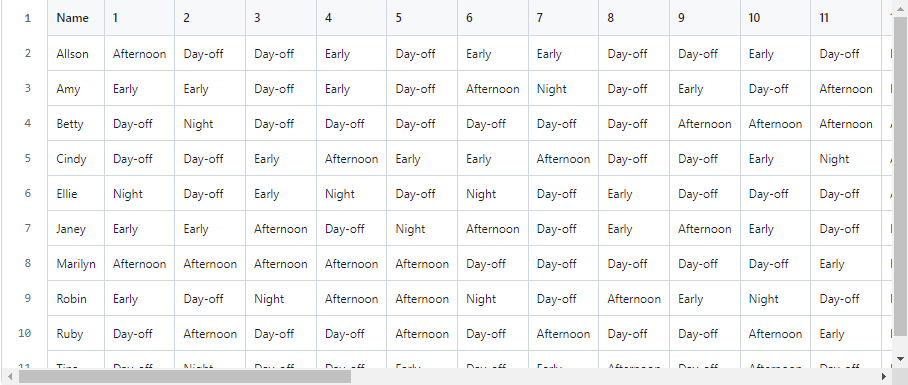
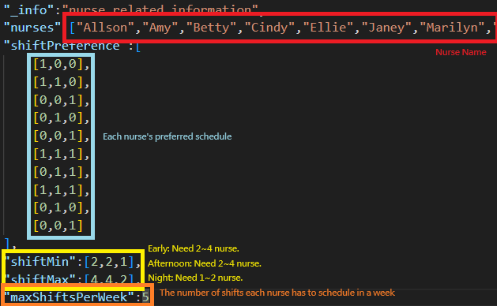
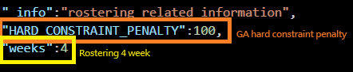
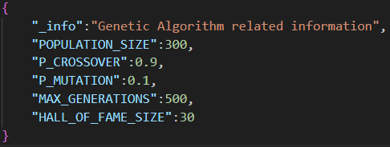
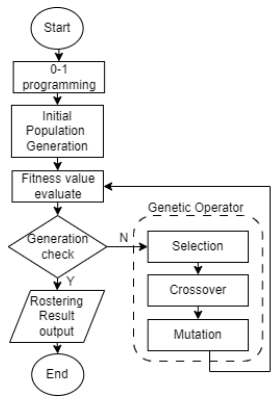

# Genetic_algorithm-nurse-rostering-scheduling


[Final Paper]()

## Description
The scheduling planning of surgical operations in the operating room belongs to the NP-hard combinational problem, and this problem has the uncertainty of patients and operation time. Nowadays, many hospitals rely on the experience of shift staff to decide the shift order, which often results in long waiting times for patients and overtime work for medical staff. Excessive waiting time for patients, in addition to the risk to the patient's life, will also affect the patient's satisfaction with the hospital. Overtime work by medical staff may cause medical staff to reduce their work performance and increase the number of medical staff working overtime in the hospital. expenses.
The operating room scheduling is different from the general ward nursing scheduling. In addition to considering the manpower needs of medical staff, the operating room scheduling also needs to take into account the priority of operations. Therefore, all possible factors in hospital scheduling planning are studied and adopted The genetic algorithm solves the scheduling problem of the operating room within an acceptable time, and achieves an objective scheduling method and shortens the waiting time of patients and overtime of medical staff.

## Dependencies
```shell
pip install deap
pip install seaborn
```

## Our Setting
* Binary Representation and Encoding.


* Shift presentation:

  | Shift | Early Shift | Afternoon Shift | Night Shift | Day-off |
  | :--: | :--: | :--: | :--: | :--: |
  | Representation | [1,0,0] | [0,1,0] | [0,0,1] | [0,0,0] |
  | Time | 7:00 ~ 15:00 | 15:00 ~ 23:00 | 23:00 ~ 7:00 | - |

## Problems
* The nurse scheduling is known to have NP-hard complexity.
* Manual shift scheduling requires certain experience.
* Scheduling results must comply with legal requirements.
* Scheduling results will take into account nurse preference.
* Using a computational search algorithm to address these problems results in cost savings and better work schedules.

## Constraints
### Hard Constraints
1. Each nurse can only work one shift a day.
2. Each nurse can't schedule two consecutive shifts.
3. Each nurse must take two day-off during the week.
4. During the early shift, there must be at least two to four nurses.
5. During the afternoon shift, there must be at least two to four nurses.
6. During the night shift, there must be at least one to two nurses.

### Soft Constraints
1. Each nurse shifts preference.

## Data Descriptions
### data.json
* Set up a simple example and enter information about nurses, schedules, and algorithms.
* **Nurse-Related Information**

  

* **Rostering-Related Information**

  

* **Genetic Algorithm-Related Information**

  

## Genetic Algorithm Description


| Parameters | Days | Crossover | Mutation | Population | Generation |
| :--: | :--: | :--: | :--: | :--: | :--: |
| Value | 31 | 0.9 | 0.1 | 300 | 500 | 100 |

| GA Part | Selection                | Crossover                          | Mutation           |
|:------:|:------------------------:|:----------------------------------:|:------------------:|
| Method | Random selection         | Two Point Crossover                | Inversion Mutation |
| Method | Roulette wheel selection | Uniform Crossover with Probability | Gaussian Mutation  |
| Method | Fitness Best Selection   | Partially Matched Crossover        | FlipBit Mutation   |
| Method | Fitness Worst selection  | Order Crossover                    |          -         |

## Codes
### Rostering.py


## Related works
* T.C. Wong, M. Xu, K.S. Chin, “A two-stage heuristic approach for nurse scheduling problem: A case study in an emergency department, ” ELSEVIER Computers & Operations Research, 2014.
* Ziyi Chen, Yajie Dou, Patrick De Causmaecker, “Neural networked-assisted method for the nurse rostering problem, ”ELSEVIER Computers & Industrial Engineering, 2022.
* Ling Wang, Quan-Ke Pan, P.N. Suganthan, Wen-Hong Wang, Ya-Min Wang, “A novel hybrid discrete differential evolution algorithm for blocking flow shop scheduling problems, ” ELSEVIER Computers & Operations Research, 2010.
* Nuraddeen Ado Muhammad, Aliyu Rabiu Shu’aibu, Yusuf Idris, Mohammed Toro Lawal, “Solving Nurse Rostering Problem Using Genetic Algorithm,” International Conference on Electrical Engineering Applications (ICEEA'2020), 2020.
* Oluwaseun M. Alade, Akeem O. Amusat, Oluyinka T. Adedeji, “SOLVING NURSE SCHEDULING PROBLEM USING CONSTRAINT PROGRAMMING (CP) TECHNIQUE, ” 2019.
* Hiroharu Kawanaka, Kosuke Yamamoto, Tomohiro Yoshikawa, Tsuyoshi Shinogi, Shinji Tsuruoka, “Genetic Algorithm with the Constraints for Nurse Scheduling Problem, ” Proceedings of the 2001 Congress on Evolutionary Computation (IEEE Cat. No.01TH8546), 2001.

## Datasets
[Shift Scheduling Benchmark Datasets - Nurse Rostering Instances](http://www.schedulingbenchmarks.org/nrp/instances1_24.html)

## Experiment Results


## Future work
1. Single Objective function improves to Multi-Objective function.
2. Improved hard constraints for medical institutions.
3. Address dynamic nurse shift situations.


